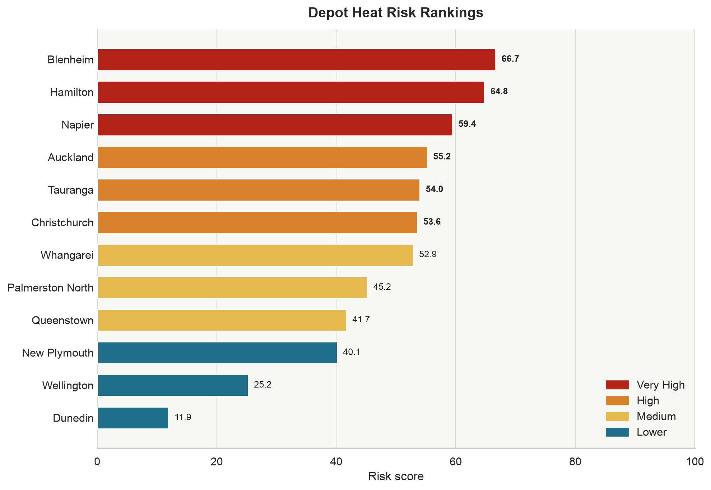
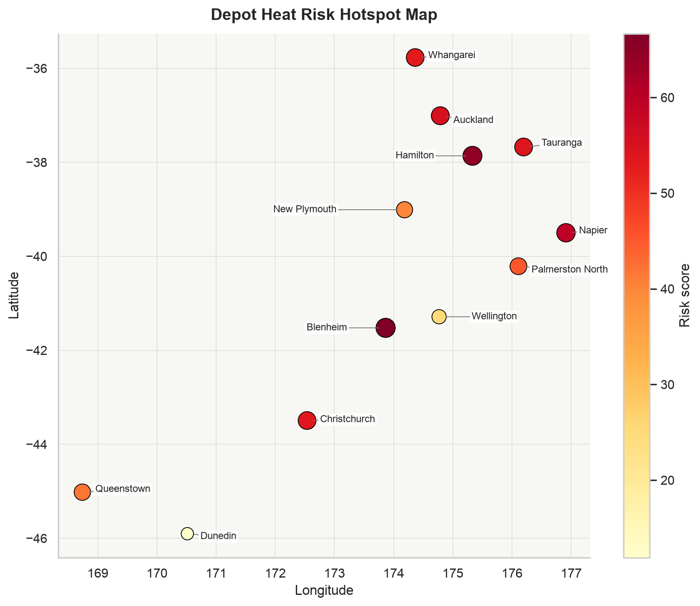
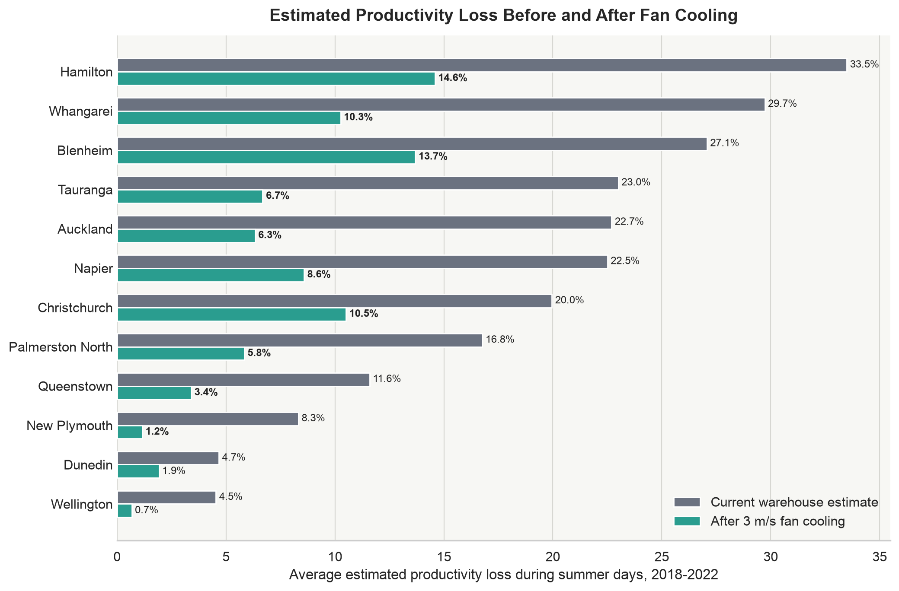

# Warehouse Heat Intelligence

This project estimates the heat stress risk across client's New Zealand warehouse locations. Using local weather data, humidity measurements, heat index calculations, and warehouse temperature amplification assumptions, the analysis identifies which sites are most exposed to indoor heat stress.

The key finding is that warehouse heat risk is not determined by air temperature alone. Humidity, building heat retention, and local climate conditions can cause similar outdoor temperatures to produce very different worker heat stress levels across sites.

The purpose of the model is to help prioritise which warehouse locations may benefit most from cooling interventions.

## Why This Matters

Warehouses are unique amongst buildings, in that they maximise for space, rather than human comfort. The main economic incentive then becomes creating the largest enclosed space, for the lowest dollar. This is reflected in the choice of materials commonly used in their construction, where floor and walls tend to be thick reinforced concrete slabs, and the roof a corrugated steel.

Although these materials are fast and inexpensive to produce, their combined physical properties can capture and store heat. Corrugated steel sheets can reach high temperatures quickly because steel has low thermal mass, low specific heat capacity, and good thermal conductivity. This allows solar energy to spread rapidly across the roof. During summer, roof surface temperatures can exceed 70°C. This heat then radiates into the building, where the high thermal mass of thick concrete walls can absorb and store energy. Heat then accumulates indoors, causing warehouse temperatures to exceed ambient outdoor conditions.

This exacerbates an already existing thermal problem. Work in a warehouse typically involves manual labour, which already generates a considerable amount of heat for the individual. If temperatures are high enough, this combined heating effect of physical labour and warehouse thermodynamics poses a direct risk on worker well-being. 

## Key Outputs







## Questions & Findings

| Question | Finding |
|---|---|
| How often does extreme heat occur across NZ warehouses? | Risk is geographically uneven across depot locations |
| How much hotter do warehouses get vs. outdoors? | Indoor amplification turns moderate outdoor heat into operationally relevant stress |
| How does humidity affect heat stress? | Humidity materially changes exposure, outdoor temp alone can't prioritise sites |
| Which locations face greatest risk? | Whangarei, Auckland, and Hamilton rank highest in the model |
| How effective are fans as mitigation? | Fan-assisted cooling materially reduces estimated productivity loss |

## Repository Structure

```text
.
├── 01_preprocessing.ipynb   # Cleans and combines raw weather files
├── 02_analysis.ipynb        # Main report: modelling, rankings, and plots
├── data/README.md           # Data source and local file layout notes
├── outputs/                 # Generated charts used in the analysis
├── scripts/                 # Reproducible command-line workflow
├── Makefile                 # Convenience commands
├── requirements.txt         # Python dependencies
└── LICENSE
```

Large raw and processed datasets are excluded from Git. See `data/README.md` for the expected local data layout and source links.

## Literature

- Heat index calculations were based on the NOAA Heat Index equation:
  https://www.wpc.ncep.noaa.gov/html/heatindex_equation.shtml

- Warehouse temperature amplification assumptions were based on Porras-Amores, Mazarrón, and Cañas (2014), who studied vertical air  temperature distribution in warehouses, and found that indoor temperatures were 2°C  - 5°C above ambient:
  https://doi.org/10.3390/en7031193

  In this project, outdoor temperatures were adjusted upward by 3.5°C to approximate indoor warehouse conditions.

- Productivity impact assumptions were based on Somanathan et al. (2021), who found that higher workplace temperatures reduce manufacturing worker productivity by 4% for every 1°C above 27°C:
  https://doi.org/10.1086/713733

- Fan cooling sensation is estimated to be 7°C, for a fan blowing at 3 m/s:
  https://doi.org/10.1080/14733315.2008.11683800

## Methodology

1. Combine daily temperature files and filter to relevant depot cities.
2. Estimate recent hot-day exposure by location.
3. Model indoor warehouse temperature as outdoor daily maximum plus 3.5 C.
4. Adjust apparent heat exposure using NOAA heat-index methodology and local humidity normals.
5. Estimate productivity loss using a temperature-productivity relationship from published literature.
6. Rank depot heat risk using warming trend, hot-day frequency, humidity burden, and indoor heat burden.
7. Compare baseline productivity loss with a fan-assisted cooling scenario.

## Assumptions

- Daily maximum outdoor temperature is used as a proxy for peak operating exposure.
- Indoor warehouse temperature is modelled as outdoor maximum temperature plus 3.5 C.
- Apparent heat is calculated using NOAA heat-index methodology.
- Productivity loss begins above an apparent indoor temperature of 27 C.
- Productivity loss increases by 4 percentage points per C above the threshold.
- Fan-assisted cooling is modelled as a 7 C perceived cooling benefit at 3 m/s airflow.

## Limitations

- The model uses city-level weather data rather than sensor readings from inside each warehouse.
- Humidity inputs are climatological normals, not daily observed humidity values.
- The productivity relationship is adapted from published research in a different operating context.
- Cooling interventions are modelled as indicative scenarios and would need site-specific validation before investment decisions.

## Data Sources

- Stats NZ daily temperature indicator: https://www.stats.govt.nz/indicators/temperature/
- NIWA mean relative humidity normals: https://niwa.co.nz/climate-and-weather/mean-relative-humidity
- NOAA heat-index equation: https://www.wpc.ncep.noaa.gov/html/heatindex_equation.shtml

## Reproducing the Analysis

Create a Python environment and install the dependencies:

```bash
python3 -m venv .venv
source .venv/bin/activate
pip install -r requirements.txt
```

Download the raw source files listed in `data/README.md` and place them in `data/raw/`.

Check that the required data files are present:

```bash
make check-data
```

Build the processed depot-level temperature file:

```bash
make preprocess
```

Execute the analysis notebook and regenerate the charts:

```bash
make analysis
```

The main reproducible workflow is:

```text
raw data -> make preprocess -> processed data -> make analysis -> outputs
```

`01_preprocessing.ipynb` is kept as an optional walkthrough of the preprocessing logic. The command-line source of truth for rebuilding processed data is `scripts/preprocess.py`.

The main report is in `02_analysis.ipynb`, and generated figures are saved to `outputs/`.
